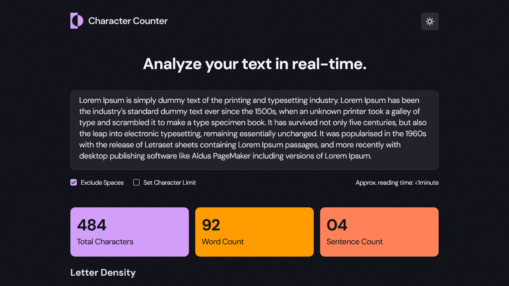
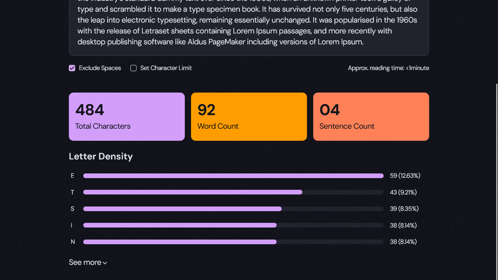
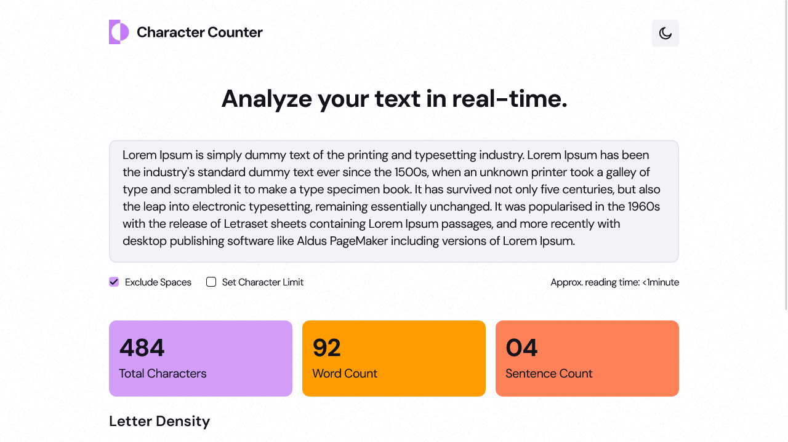
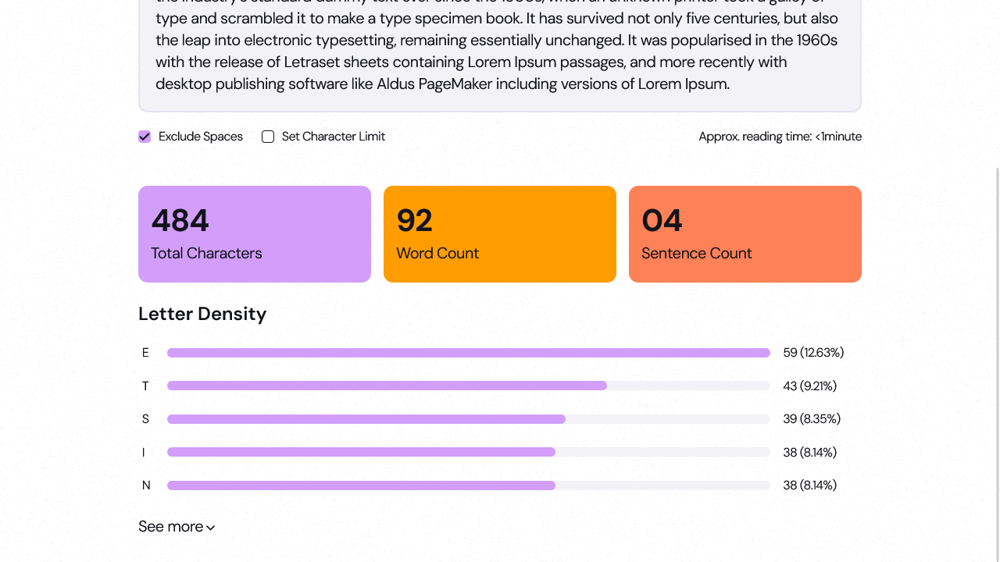
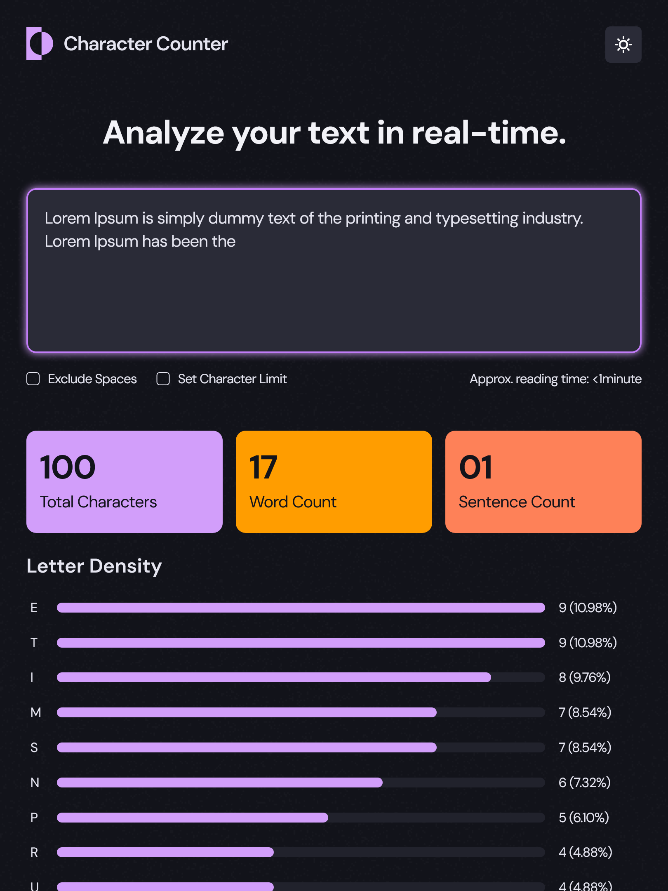
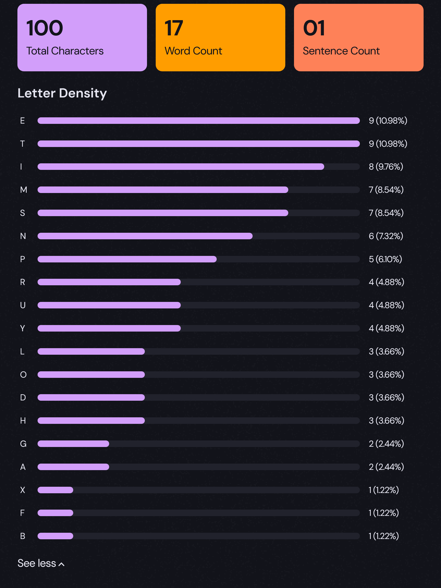
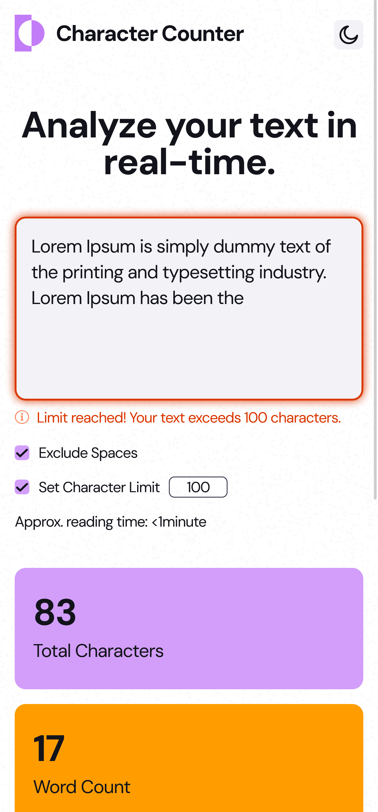
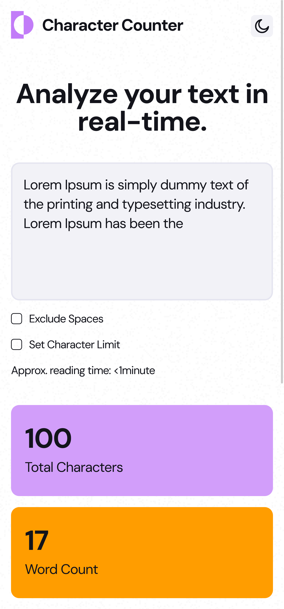

# Frontend Mentor - Character counter solution

This is a solution to the [Character counter challenge on Frontend Mentor](https://www.frontendmentor.io/challenges/character-counter-znSgeWs_i6). Frontend Mentor challenges help you improve your coding skills by building realistic projects. 

## Table of contents

- [Overview](#overview)
  - [The challenge](#the-challenge)
  - [Screenshot](#screenshot)
  - [Links](#links)
- [My process](#my-process)
  - [Built with](#built-with)
  - [What I learned](#what-i-learned)
  - [Useful resources](#useful-resources)
- [Author](#author)
- [Acknowledgments](#acknowledgments)

## Overview

### The challenge

Users should be able to:

- Analyze the character, word, and sentence counts for their text
- Exclude/Include spaces in their character count
- Set a character limit
- Receive a warning message if their text exceeds their character limit
- See the approximate reading time of their text
- Analyze the letter density of their text
- Select their color theme
- View the optimal layout for the interface depending on their device's screen size
- See hover and focus states for all interactive elements on the page

### Screenshot

1. Desktop Dark mode:

  
  

2. Desktop Light mode:

  
  

3. Tablet Dark (hover + expanded letter density):

  
  

4. Mobile Light (limit exceed + with and without exclude spaces):

  
  

### Links

- Solution URL: [Character Counter App Solution](https://github.com/kapil-2695/fmc-character-counter)
- Live Site URL: [Live Site - Character Counter App](https://character-counter-176.netlify.app)

## My process

### Built with

- Semantic HTML5 markup
- CSS custom properties
- Flexbox
- CSS Grid
- Mobile-first workflow
- [React](https://reactjs.org/) - JS library
- React Coumpound Components
- React Context
- Regex

### What I learned

- Revised by extensively using Regex expressions to detect patterns in text.

### Useful resources

- [Learn CSS - web.dev](https://web.dev/learn/css/) - This helped me with CSS code.
- [Learn React - scrimba](https://scrimba.com/learn-react-c0e) 
- [Advanced React - scrimba](https://scrimba.com/advanced-react-c02h) - This is where I learned React fully.

## Author

- Frontend Mentor - [@kapil-2695](https://www.frontendmentor.io/profile/kapil-2695)

## Acknowledgments

- I want to thank CSS expert Kevin Powell for creating informative content on his YouTube channel which helped me a lot in perfecting the designs.

- I want to thank scrimba for providing me with the great lessons because of which I could throughly understand React and the concepts behind it.

- I also want to thank Frontend mentor for creating such nice challenges for developers to sharpen their skills.
